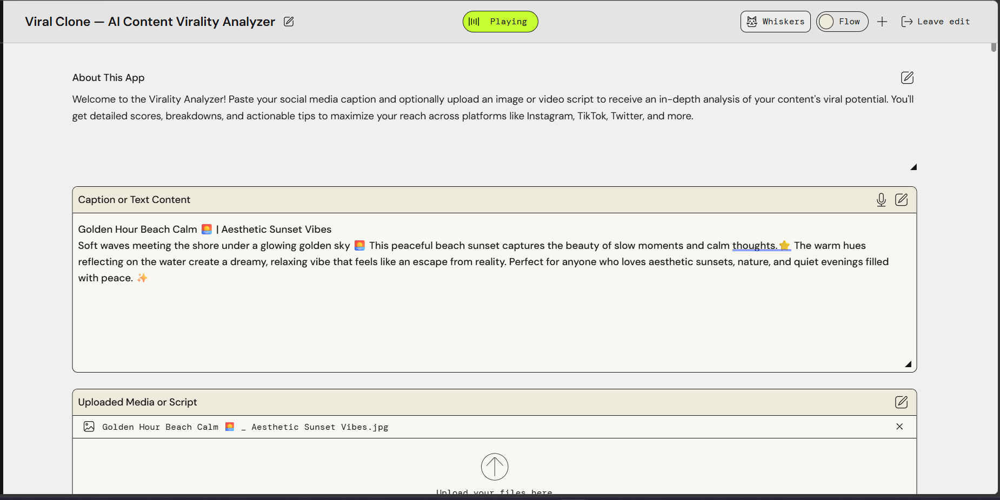
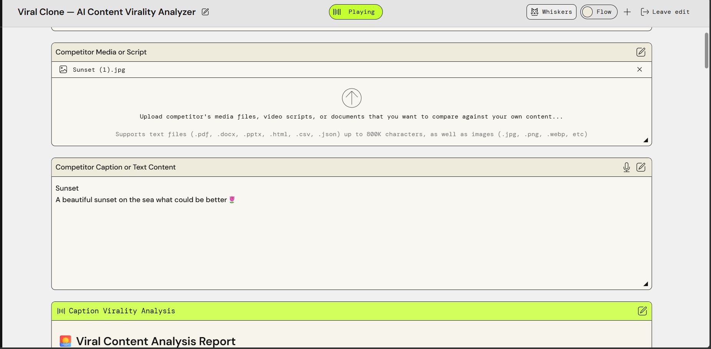
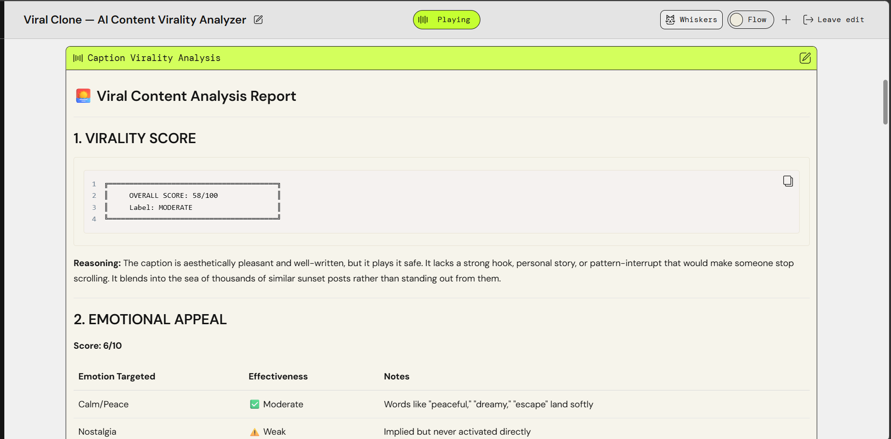
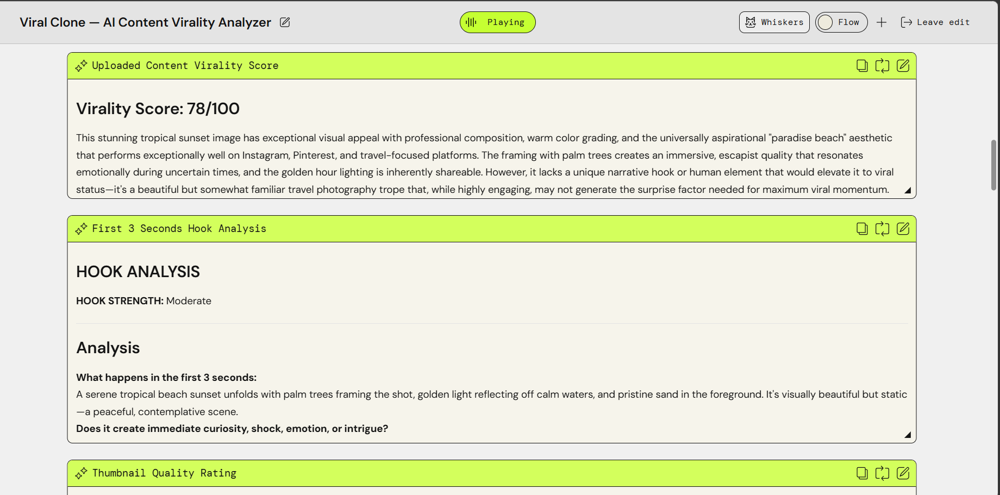
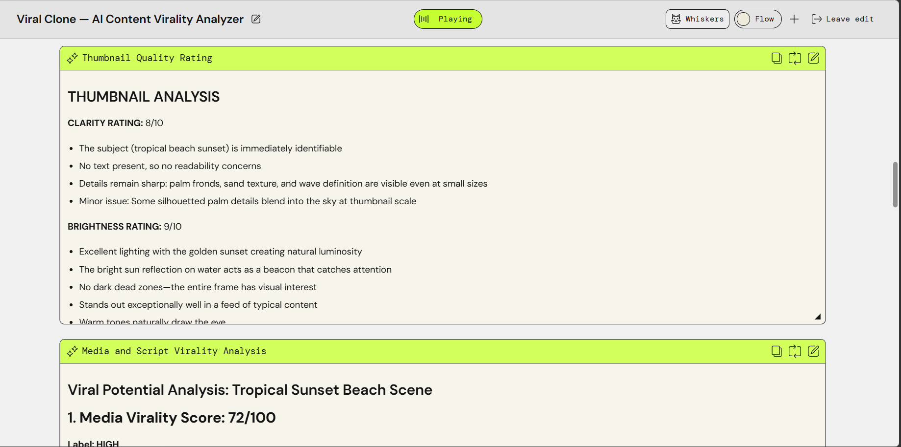
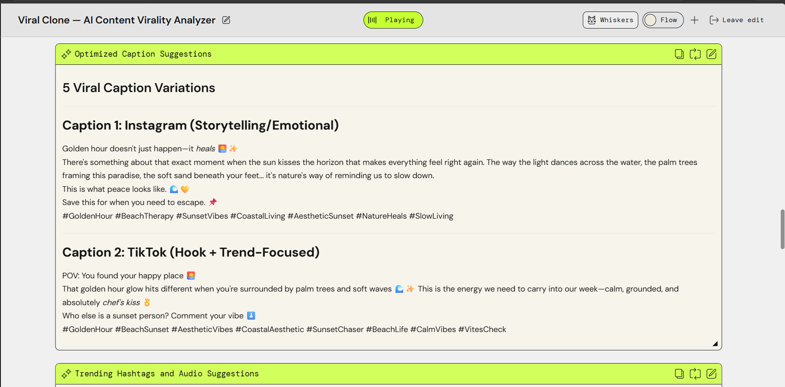
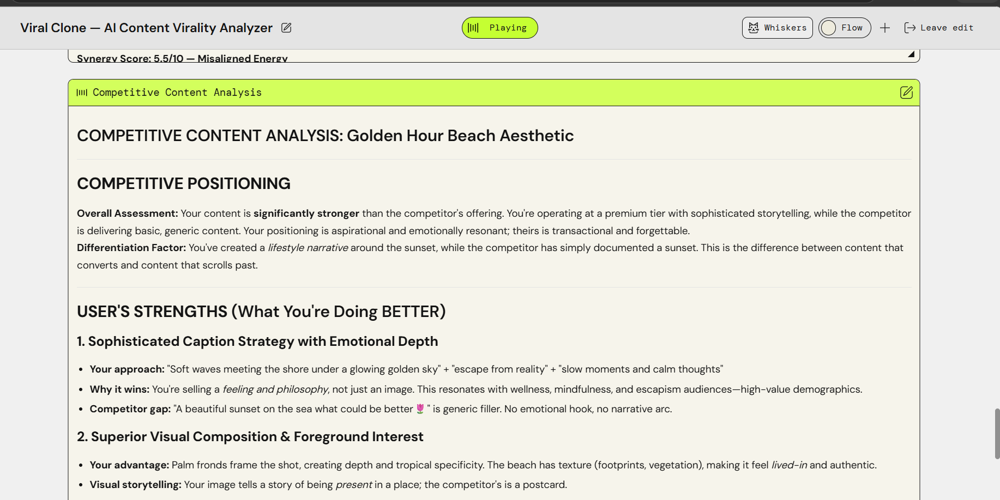

# AI-Content-Virality-Analyzer
## About
This project analyzes captions, media, and scripts to predict content virality. It provides insights into hooks, hashtags, thumbnails, and overall platform strategy.

## Features
- Caption virality analysis
- Content virality score + 3-second hook
- Thumbnail quality rating
- Media/script virality analysis
- Optimized caption suggestions
- Trending hashtags & audio suggestions
- Overall virality assessment
- Competitive content analysis

## Demo
[Watch the Loom Video](https://www.loom.com/share/6c1dc116c6bb450395e73b5f00f42b9c)

## Screenshots

## Reflection
See [ai-logs/Reflection.md](ai-logs/Reflection.md) for detailed insights.
